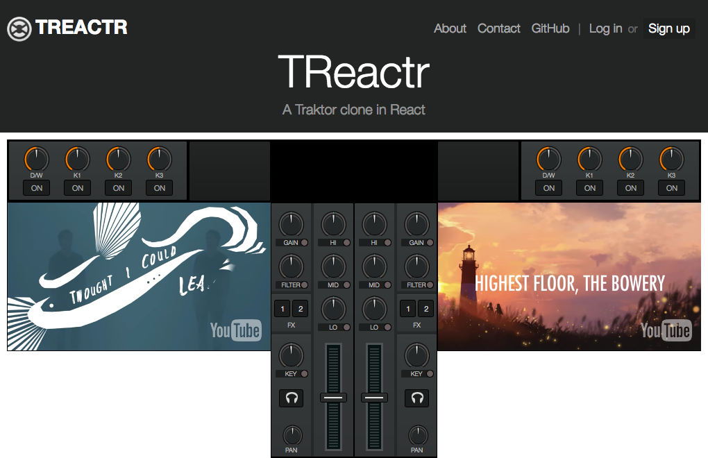

# TReactr
A Traktor clone in React

<a href="https://treactr.herokuapp.com"></img></a>

TReactr is a javascript digital DJ mixing application built for the modern web, based on the legendary UI from Native Instruments' Traktor.

## Features:
Treactr was made with Node.js, Express, GraphQL, React, Babel, ESLint, PostCSS, Webpack, and Browsersync.

## Install:
This project uses `yarn` for managing packages, running build scripts, and starting the development server.
If you don't already have `yarn` you can install it with:

    npm install -g yarn

To install Treactr, use:

    yarn

This is equivalent to `yarn install` or `npm install`.

## Run:
To start the dev server and launch Treactr in your browser, use:

    yarn start

This is equivalent to `npm start`.

For a full list of scripts that can be ran with `yarn` or `npm`, see `package.json`.

## To-Do List:
  If you want to help with development, there's a to-do list of features that need to be implemented:

  <a href="https://gist.github.com/kevinchau321/7d64516debdfeb31257169e521135d63"> Treactr To-Do Gist </a>
